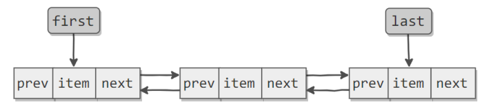

#### 问题描述：ArrayList和LinkedList有什么区别。

#### 参考答案：


- 数据结构

  ```
  public class ArrayList<E> extends AbstractList<E>
          implements List<E>, RandomAccess, Cloneable, java.io.Serializable
  {
  	/**
       * Default initial capacity.
       */
      private static final int DEFAULT_CAPACITY = 10;
      
  	transient Object[] elementData; // non-private to simplify nested class access
  	……
  }
  ```

  ArrayList 基于Object数组实现，可以利用 index 的特性进行快速查找，RandomAccess 接口表明它支持快速随机访问。

  ------

  

  ```
  public class LinkedList<E>
      extends AbstractSequentialList<E>
      implements List<E>, Deque<E>, Cloneable, java.io.Serializable
  {
      transient int size = 0;
  
      /**
       * Pointer to first node.
       * Invariant: (first == null && last == null) || (first.prev == null && first.item != null)
       */
      transient Node<E> first;
  
      /**
       * Pointer to last node.
       * Invariant: (first == null && last == null) || (last.next == null && last.item != null)
       */
      transient Node<E> last;
      ……
  }
  ```

  LinkedList使用了双向链表实现，使用静态内部类 Node 来存储元素(原理如图示)。

  

- 查询

  ```
  // ArrayList 
  public E get(int index) {
      rangeCheck(index);
  
      return elementData(index);
  }
  
  E elementData(int index) {
  	return (E) elementData[index];
  }
  ```

  ArrayList 数组的数据结构使得它可以使用索引下标进行随机快速访问元素数据。

  ------

  

  ```
  // LinkedList
  public E get(int index) {
      checkElementIndex(index);
      return node(index).item;
  }
  
  Node<E> node(int index) {
  	// assert isElementIndex(index);
  
  	if (index < (size >> 1)) {
  		Node<E> x = first;
  		for (int i = 0; i < index; i++)
  			x = x.next;
  		return x;
  	} else {
  		Node<E> x = last;
  		for (int i = size - 1; i > index; i--)
  			x = x.prev;
  		return x;
  	}
  } 
  ```

  LinkedList 双向链表的数据结构使得它只能进行顺序查找访问，因此就查询来说ArrayList 的效率要高于LinkedList（源码可知，它提供的 get(int index)方法实际上也是走的链表顺序查询，而不是真正的索引快速查找）。

- 删除

  ```
  // ArrayList
  public E remove(int index) {
  	rangeCheck(index);
  
  	modCount++;
  	E oldValue = elementData(index);
  
  	int numMoved = size - index - 1;
  	if (numMoved > 0)
  		System.arraycopy(elementData, index+1, elementData, index,
  						 numMoved);
  	elementData[--size] = null; // clear to let GC do its work
  
  	return oldValue;
  }
  
  /** System.arraycopy(Object src,int  srcPos,Object dest, int destPos,int length); */
  ```

  

  ArrayList 在删除元素的时候，要将去除删除元素的剩余元素重新拷贝到一个新的数组，并重新索引删除元素后的元素，可见 ArrayList 在删除元素时的效率比较低。

  ------

  ```
  // LinkedList 
  public E remove(int index) {
      checkElementIndex(index);
      return unlink(node(index));
  }
  
  E unlink(Node<E> x) {
  	// assert x != null;
  	final E element = x.item;
  	final Node<E> next = x.next;
  	final Node<E> prev = x.prev;
  
  	if (prev == null) {
  		first = next;
  	} else {
  		prev.next = next;
  		x.prev = null;
  	}
  
  	if (next == null) {
  		last = prev;
  	} else {
  		next.prev = prev;
  		x.next = null;
  	}
  
  	x.item = null;
  	size--;
  	modCount++;
  	return element;
  }
  ```

  LinkedList 的删除操作就相对高效，直接改变删除元素首位的node 引用，然后将当前要删除的元素的引用置位null即可，没有额外的复制操作。

  

