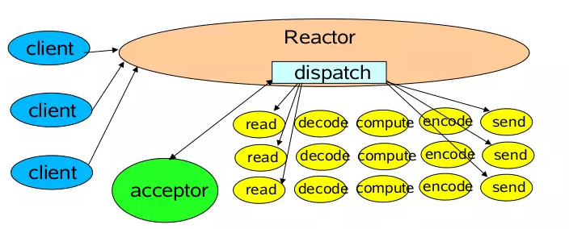
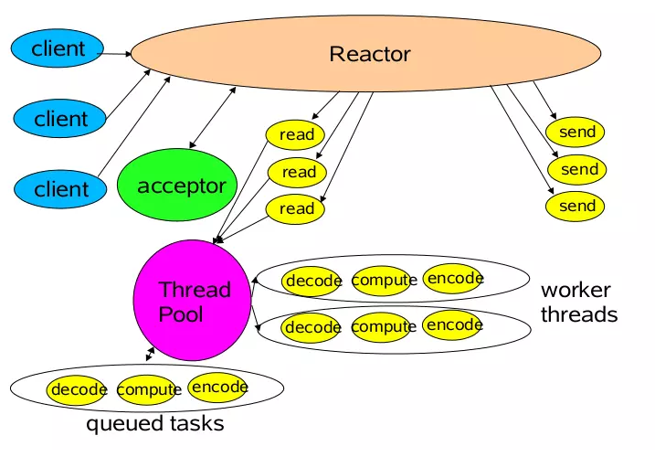
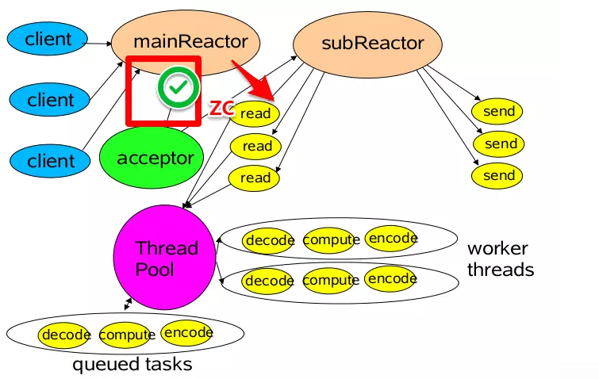

#### 题目：IO模型有哪些，讲讲你理解的nio，他和bio，aio的区别是啥，谈谈reactor模型

#### 参考答案：

我们通常讨论的IO模型重点指的是网络IO，即socket。

一个输入操作通常包括两个阶段：

​	1 等待数据准备好

​	2 从内核向进程复制数据

##### 对于一个socket的输入操作，第一步通常涉及等待数据从网络中到达，当所等待数据到达时，它被复制到内核中的某个缓冲区。第二步就是把数据从内核缓冲区

##### 复制到应用进程缓冲区。

> Unix 的五种 I/O 模型：

> - 阻塞式 I/O
> - 非阻塞式 I/O
> - I/O 复用（select 和 poll）
> - 信号驱动式 I/O（SIGIO）
> - 异步 I/O（AIO）

注意区别同步/异步、阻塞/非阻塞的区别。

##### 当我们说同步/异步的时候，我们指的是进程在IO的过程中会不会被阻塞，如果会阻塞那么就是同步，不会阻塞就是异步。

##### 而当我们说阻塞/非阻塞的时候，我们指进程阻塞的阶段，I/O 复用和信号驱动式 I/O在第一阶段不会阻塞，阻塞IO直到IO完成之前一直处于阻塞进程阶段，而非阻塞IO，在第一阶段不会阻塞应用进程，而是轮训第一阶段的数据是否到达，在复制到应用进程缓冲区的过程中会阻塞进程。

##### `NIO`

NIO( New IO) 同步非阻塞IO，从JDK 1.4开始引入了NIO模型，用于丰富IO操作类型，同时变得更加高效。

**NIO在IO过程中，使用 select 或者 poll 等待数据，并且可以等待多个套接字中的任何一个变为可读。这一过程会被阻塞，当某一个套接字可读时返回，之后再使用 recvfrom 把数据从内核复制到进程中。它可以让单个进程具有处理多个 I/O 事件的能力。又被称为 Event Driven I/O，即事件驱动 I/O。**

如果一个 Web 服务器没有 I/O 复用，那么每一个 Socket 连接都需要创建一个线程去处理。如果同时有几万个连接，那么就需要创建相同数量的线程。相比于多进程和多线程技术，I/O 复用不需要进程线程创建和切换的开销，系统开销更小。

相对于BIO的流，NIO抽象出了新的通道（Channel）作为输入输出的通道，并且提供了缓存（Buffer）的支持，在进行读操作时，需要使用Buffer分配空间，然后将数据从Channel中读入Buffer中，对于Channel的写操作，也需要现将数据写入Buffer，然后将Buffer写入Channel中。

`BIO`:  阻塞IO，"最原始的"IO，在IO过程中会一直阻塞当前应用进程（注意其它无关应用进程是不会阻塞的，他并不是说阻塞整个操作系统）。

`AIO` (Asynchronous I/O) 异步非阻塞I/O：

应用进程执行 aio_read 系统调用会立即返回，应用进程可以继续执行，不会被阻塞，内核会在所有操作完成之后向应用进程发送信号。

异步 I/O 与信号驱动 I/O 的区别在于，异步 I/O 的信号是通知应用进程 I/O 完成，而信号驱动 I/O 的信号是通知应用进程可以开始 I/O，也就是说当异步 I/O 的信号发出时，表名已经完成IO，进程直接可以开始使用，因此，AIO不会阻塞应用进程。

------

##### reactor

前面了解到，java的NIO是属于同步非阻塞IO，关于IO多路复用，java没有相应的IO模型，但有相应的编程模式，Reactor 就是基于NIO中实现多路复用的一种模式。

reactor 的三种角色：

- **Reactor** 将I/O事件分派给对应的Handler
- **Acceptor** 处理客户端新连接，并分派请求到处理器链中
- **Handlers** 执行非阻塞读/写 任务

##### 1 单Reactor单线程模型

这是最基本的单Reactor单线程模型。其中Reactor线程，负责多路分离套接字，监听新连接触发connect 事件之后，交由Acceptor进行处理，有IO读写事件之后交给hanlder 处理。

Acceptor主要任务是构建handler ，在获取到和client相关的SocketChannel之后 ，绑定到相应的hanlder上，对应的SocketChannel有读写事件之后，基于racotor 分发,hanlder就可以处理了。

##### 2 单Reactor多线程模型

相对于第一种单线程的模式来说，在处理业务逻辑，也就是获取到IO的读写事件之后，交由线程池来处理，这样可以减小主reactor的性能开销，从而更专注的做事件分发工作了，从而提升整个应用的吞吐。

##### 3 多Reactor多线程模型

第三种模型比起第二种模型，是将Reactor分成两部分，

1. ##### mainReactor负责监听server socket，用来处理新连接的建立，将建立的socketChannel指定注册给subReactor。

2. ##### subReactor维护自己的selector, 基于mainReactor 注册的socketChannel多路分离IO读写事件，读写网 络数据，对业务处理的功能，另其扔给worker线程池来完成。

mainReactor 主要是用来处理网络IO 连接建立操作，通常一个线程就可以处理，而subReactor主要做和建立起来的socket做数据交互和事件业务处理操作，它的个数上一般是和CPU个数等同，每个subReactor一个线程来处理。

此种模型中，每个模块的工作更加专一，耦合度更低，性能和稳定性也大量的提升，支持的可并发客户端数量可达到上百万级别。

